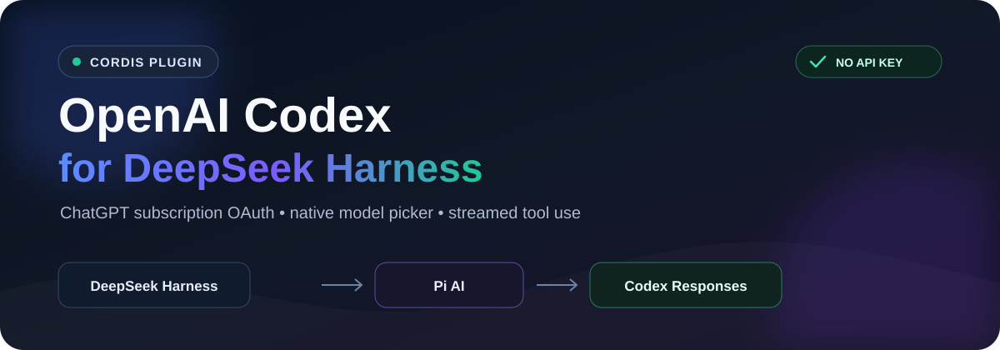
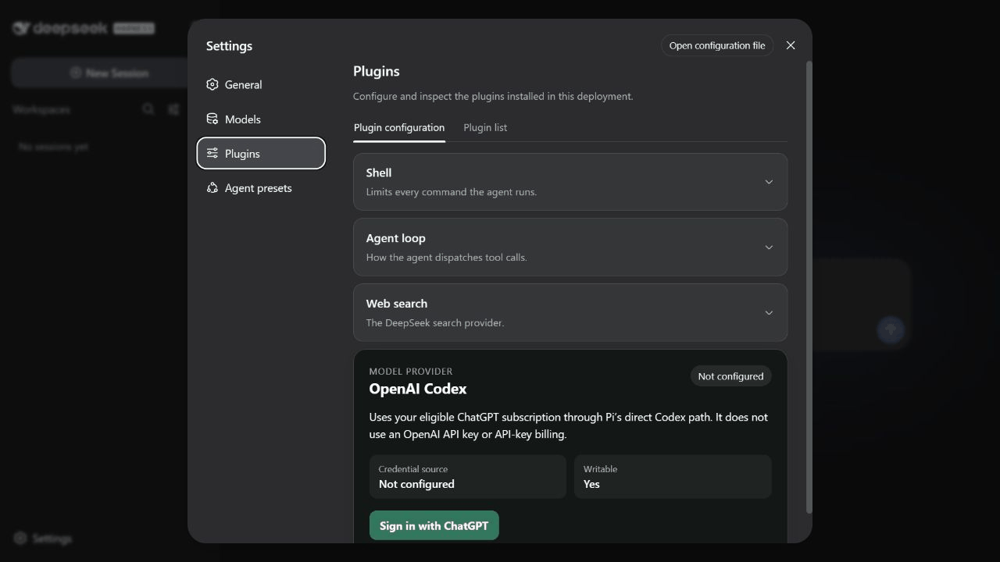
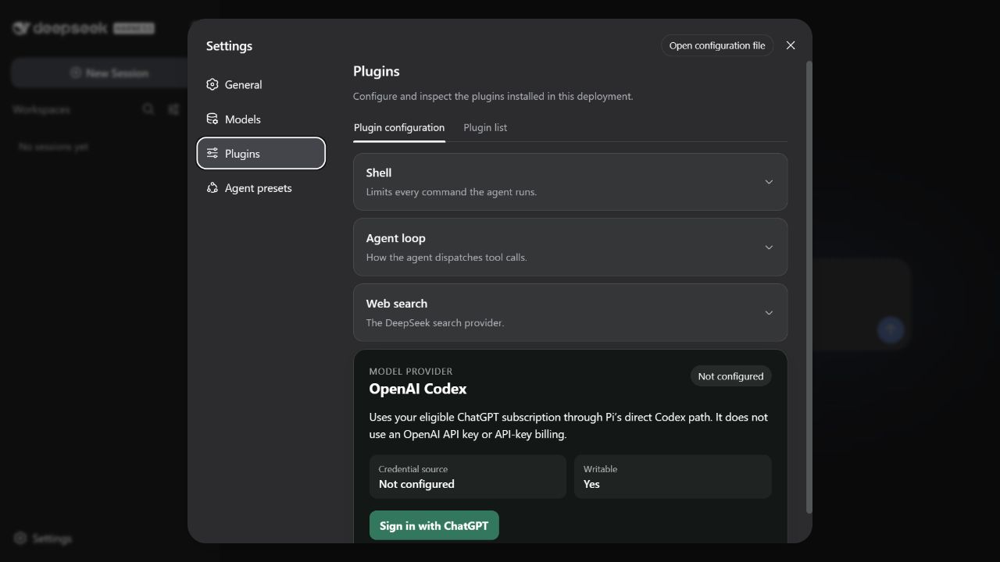
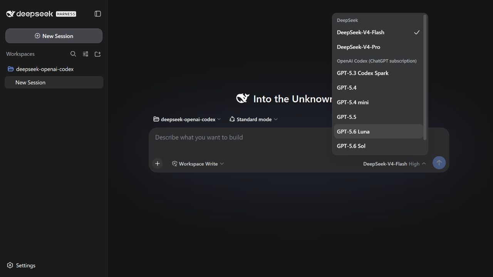
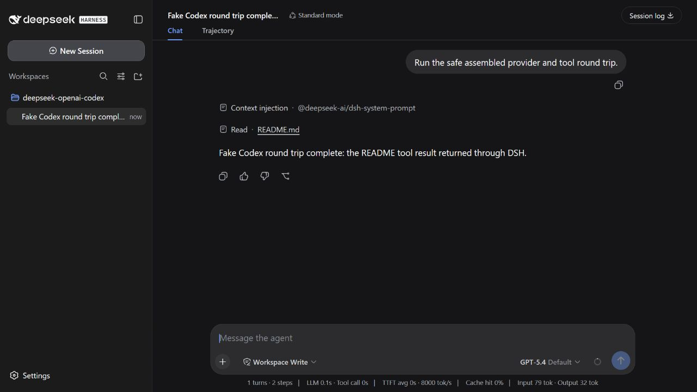

<p align="center">
  <a href="https://github.com/OpenCnid/deepseek-openai-codex">
    
  </a>
</p>

<p align="center">
  
  
  
  
</p>

# OpenAI Codex for DeepSeek Harness

Use OpenAI Codex models from an eligible ChatGPT subscription inside
[DeepSeek Harness](https://github.com/deepseek-ai/DeepSeek-Harness). This
standalone Cordis plugin adds the `openai-codex` provider while DeepSeek
Harness continues to own the agent loop, tools, approvals, sessions, and UI.

> [!IMPORTANT]
> The plugin currently supports **DSH `0.1.0-rc.7` only** and is not published
> to npm. Install it from a local checkout as shown below.

## Why this plugin

- **Subscription OAuth:** signs in with ChatGPT; it does not use
  `OPENAI_API_KEY` or API-key billing.
- **Native Harness workflow:** Codex models appear in the normal DeepSeek
  Harness model picker and participate in regular tool calls.
- **Host-owned credentials:** OAuth state is stored through DSH credentials,
  with validation, refresh serialization, bounded replay, and sanitized errors.
- **Direct provider path:** requests stream through
  `@earendil-works/pi-ai`; no Codex CLI or `codex app-server` is required.

```text
DeepSeek Harness  →  Cordis plugin  →  Pi AI  →  OpenAI Codex Responses API
 agent + tools        auth + adapter    OAuth        streamed response
```

The root export `OPENAI_CODEX_TRANSPORT_CAPABILITIES` advertises the bounded
`ordered_system_user_messages_v1` path. For a nonempty ordered history of
single-text-block `system` and `user` messages, the plugin uses Pi's public
payload hook to preserve every role, position, and exact text while requiring
an explicit output-token limit, disabling tools, and keeping retries at zero.
Unsupported shapes and unexpected Pi payload fields fail closed; ordinary
requests continue through the existing conversion path. Provider-free wire
tests prove construction of this payload, but live acceptance of a trailing
system item remains unclaimed until an authorized conformance call succeeds.

## Quick start

Prerequisites: Node.js `>=22.19.0`, pnpm `11.19.0`, and the complete DeepSeek
Harness `0.1.0-rc.7` package set.

```sh
git clone https://github.com/OpenCnid/deepseek-openai-codex.git
cd deepseek-openai-codex
pnpm install --frozen-lockfile
pnpm run build
pnpm pack --pack-destination ./dist-pack
```

Install the packed plugin into your DSH profile, verify its configuration, and
start the profile:

```sh
dsh plugin --profile web add ./dist-pack/deepseek-openai-codex-0.1.0.tgz
dsh --profile web --dump-config
dsh --profile web
```

The config dump should contain exactly one row with the id
`deepseek-openai-codex`.

## Connect your ChatGPT subscription

1. In DSH, open **Settings → Plugins**.
2. Find **OpenAI Codex** and select **Sign in with ChatGPT**.
3. Choose the browser or device-code flow and complete the prompts.
4. Wait for **Configured**, then select an OpenAI Codex model from the normal
   model picker.

<p align="center">
  
</p>

<p align="center"><sub>Safe assembled workflow: sign in → select a model → run a tool round trip → log out. No real credential is recorded.</sub></p>

<details>
<summary>View the key screens</summary>

| Sign in | Choose a Codex model | Complete a tool round trip |
| --- | --- | --- |
|  |  |  |

</details>

## Credential safety

`OPENAI_CODEX_OAUTH` is a plugin-owned DSH credential reference containing a
Pi OAuth credential—not a generic API key. Do not copy it into settings, edit
it manually, reuse it for another provider, or commit it. Sign-in succeeds only
after the credential is durably stored; logout removes it through the active
credential provider.

ChatGPT subscription access and OpenAI API billing are separate products.
Setting `OPENAI_API_KEY` does not configure this plugin and is never used as a
fallback.

## Common fixes

- **Plan or permission error:** confirm the ChatGPT account is eligible for
  Codex subscription access, then sign in again.
- **Expired or cancelled login:** select **Retry sign-in** in the plugin card.
- **Read-only credential provider:** make the active provider for
  `OPENAI_CODEX_OAUTH` writable.
- **Provider collision:** remove the other plugin that owns `openai-codex`;
  this plugin deliberately refuses to register an alias.
- **Plugin card does not load:** confirm every DSH web package is from
  `0.1.0-rc.7`.

See [COMPATIBILITY.md](COMPATIBILITY.md) for the audited package matrix and
[INTEGRATION_PROOF.md](INTEGRATION_PROOF.md) for the clean-tarball and assembled
DSH acceptance record.

## Development

```sh
pnpm install --frozen-lockfile
pnpm run typecheck
pnpm run lint
pnpm run test
pnpm run build
pnpm run pack:inspect
```

The test suite covers credential durability and locking, auth coordination,
mounted Host Remote calls, request and stream conversion, Pi's direct
transport, browser interactions, lifecycle cleanup, and package metadata.

The implementation contract lives in [SPEC.md](SPEC.md). Contributor and agent
guidance lives in [AGENTS.md](AGENTS.md), and adapted DSH conversion code is
acknowledged in [THIRD_PARTY_NOTICES.md](THIRD_PARTY_NOTICES.md).

## Remove

```sh
dsh plugin --profile web remove deepseek-openai-codex
```

Restart the profile after removal. Uninstalling does not silently delete stored
credentials; use **Log out** first if you also want to remove
`OPENAI_CODEX_OAUTH`.

## Release status

The package is implemented, tested, locally packable, intentionally private,
and not published. A public release still requires repository-owner decisions
about licensing, package ownership, visibility, and third-party notices. Do not
publish it until those gates are resolved.
