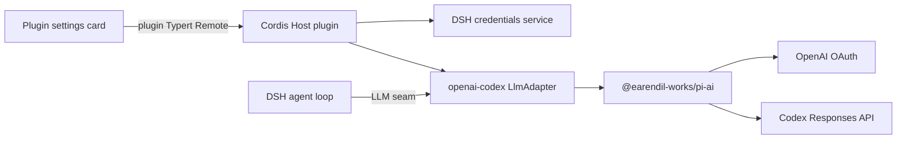

# `deepseek-openai-codex` standalone plugin specification

Status: implementation-ready design; no implementation exists yet.

This document is normative for the first implementation of `deepseek-openai-codex`.
The words **must**, **must not**, **should**, and **may** express requirement strength.

## 1. Outcome

Build one independently versioned and installable Cordis plugin package named `deepseek-openai-codex`.
The package must let DeepSeek Harness use ChatGPT-subscription-backed OpenAI Codex models through Pi's direct provider path.

DeepSeek Harness remains the agent harness:

- DSH owns the agent loop, message history, tools, approvals, sessions, compaction, and UI shell.
- The plugin owns the `openai-codex` LLM route, OAuth lifecycle, credential bridge, provider translation, and plugin settings card.
- `@earendil-works/pi-ai` owns OpenAI's OAuth protocol, token refresh rules, model catalog, Codex request construction, and streaming transport.
- OpenAI receives Pi-compatible direct requests, including `originator: pi`.

The implementation must not patch, vendor into, or require a fork of DeepSeek Harness.

## 2. Why a standalone plugin

DeepSeek Harness is designed around out-of-tree Cordis plugins and profile bundle layers.
The required integration points already exist:

- `ctx.llm.registerAdapter()` registers a provider route.
- `ctx.llm.registerConfigurableProviders()` exposes a provider in model configuration surfaces.
- `ctx.credentials` provides durable secret storage through opaque credential references.
- a package-local Typert Remote can expose Host operations to the browser client.
- `dsh.client` publishes a browser plugin without rebuilding the DSH web application.
- `dsh.bundle` lets `dsh plugin --profile ... add ...` activate a package-owned patch layer.

The existing `@deepseek-ai/dsh-llm-pi-ai` package is a useful implementation reference, but it is not the requested integration.
Its current adapter creates Pi models without a Pi `CredentialStore`, and its configurable catalog intentionally withholds OAuth-only `openai-codex`.
This plugin therefore owns a dedicated adapter that can give Pi an OAuth-capable credential store.

## 3. Goals

The first release must provide:

1. An out-of-tree Cordis Host plugin mounted by a package-owned bundle patch.
2. Exactly one DSH provider route named `openai-codex`.
3. ChatGPT subscription login, refresh, status, cancellation, and logout through Pi's public APIs.
4. Durable OAuth storage through `ctx.credentials`, never through DSH settings or a second token file.
5. A Settings → Plugins card for the complete auth lifecycle.
6. DSH-to-Pi request conversion and Pi-to-DSH stream conversion with tool-call, reasoning, replay-state, usage, cancellation, and error semantics preserved.
7. Pi's direct Codex Responses transport with `originator: pi` and Pi's `User-Agent` behavior.
8. Installation into an unmodified DSH profile with `dsh plugin --profile <name> add ...`.
9. Unit, wire, browser, lifecycle, packaging, and assembled-profile tests.

## 4. Non-goals

The first release must not:

- start, supervise, or speak the protocol of `codex app-server`;
- require the Codex CLI, read `CODEX_HOME`, or reuse Codex CLI session files;
- change DSH's agent loop, built-in Models page, credentials provider, or core packages;
- change Pi's OAuth or Codex transport implementation;
- support OpenAI API-key billing under the `openai-codex` route;
- register generic OpenAI, Azure OpenAI, or other Pi providers;
- expose an OpenAI base-URL override for the subscription route;
- publish the npm package or select a project license without repository-owner approval;
- promise compatibility with unpublished DSH APIs.

## 5. Compatibility baseline and release gate

### 5.1 Audited baselines

The design was audited against:

- DeepSeek Harness tag `dsh-v0.1.0-rc.7`, commit `99f6f02fecdb7dff40c3fbc9470f5907c29f74ca`.
- Pi commit `59a71b235dadb4ad0d67557a8abb0aaa093e68b4`.
- npm package `@earendil-works/pi-ai@0.84.2`.

The implementation must pin `@earendil-works/pi-ai` to exactly `0.84.2` initially.
Do not use a caret or tilde range for Pi until an explicit compatibility policy and provider-wire regression suite exist.

### 5.2 DSH package-publication preflight

The audited DSH repository tag reports package versions newer than several versions currently visible on npm.
Before implementation, enumerate every DSH package and subpath the plugin needs, then verify that one mutually compatible published version set provides those exact public exports.

Registry observation on 2026-08-19:

- `@deepseek-ai/dsh-llm` resolved to `0.0.1-rc.1`;
- `@deepseek-ai/dsh-credentials` resolved to `0.0.1-rc.1`;
- `@deepseek-ai/dsh-typert-protocol` resolved to `0.1.0-rc.6`;
- the audited DSH tag reports `0.1.0-rc.7` for its current workspace packages;
- `deepseek-openai-codex` returned npm `E404`, but the name must be checked again immediately before publication.

At minimum, verify the public availability and types for:

- `@deepseek-ai/cordis`;
- `@deepseek-ai/dsh-llm`;
- `@deepseek-ai/dsh-credentials`;
- the settings Service Definition and browser settings APIs;
- the Typert protocol, loader, registry, and browser remote dependencies;
- the browser runtime, slots, and UI primitives used by the card;
- any attachment and timeout APIs used by the adapter.

If npm lacks a compatible set, implementation may continue against a separate checkout of the pinned DSH tag for local development and assembled integration tests, but:

- the DSH checkout must remain unmodified;
- committed package metadata must not contain developer-machine `file:`, `link:`, or absolute-path dependencies;
- tests must clearly distinguish pinned-checkout development from published-package compatibility;
- npm publication remains blocked until the required DSH APIs are published or the plugin is revised to use published APIs only.

Do not silently substitute similarly named older APIs.

### 5.3 Compatibility posture

The plugin must fail at load with a precise diagnostic when a required service or public API is absent.
It must fail at load if another adapter or configurable-provider declaration already owns `openai-codex`.
It must not register a second alias to bypass a collision.

## 6. Architecture



No request or event travels through Codex App Server.

### 6.1 One package, four runtime faces

The repository should produce one npm package with these public faces:

| Export | Runtime | Responsibility |
| --- | --- | --- |
| `.` | Node Host | Cordis plugin, configuration, registrations, auth coordinator |
| `./client` | Browser | Settings card and auth interaction UI |
| `./typert` | Node Host | Plugin-owned RPC reflection registration |
| `./remote` | Browser/types | Generated typed client for the plugin RPC |
| `./package.json` | Node/tooling | DSH manifest discovery |

Internal modules should separate adapter, conversion, credential store, locking, auth attempts, errors, and configuration.

### 6.2 Suggested repository layout

```text
src/
  index.ts
  config.ts
  adapter.ts
  context.ts
  stream.ts
  errors.ts
  auth/
    credential-store.ts
    credential-codec.ts
    lock.ts
    coordinator.ts
    types.ts
  typert/
    index.ts
    auth.remote.ts
  client/
    index.ts
    auth-card.tsx
    auth-card.css
tests/
  unit/
  wire/
  integration/
  browser/
cordis.patch.yml
package.json
tsconfig.json
tsdown.config.ts
```

Names may change when required by the build system, but the separation of responsibilities must remain.

## 7. Package and profile integration

### 7.1 Package identity

The npm package name must be `deepseek-openai-codex`.
The package must use ESM and publish compiled JavaScript plus declarations.
It must not publish TypeScript source as an accidental runtime dependency.

The final manifest must include:

```json
{
  "name": "deepseek-openai-codex",
  "type": "module",
  "exports": {
    ".": {},
    "./client": {},
    "./typert": {},
    "./remote": {},
    "./cordis.patch.yml": "./cordis.patch.yml",
    "./package.json": "./package.json"
  },
  "dsh": {
    "bundle": {
      "patch": "./cordis.patch.yml"
    },
    "client": {
      "platform": "web",
      "inject": []
    }
  }
}
```

The empty export conditions and injection list above are placeholders.
The implementation must replace them with the exact built files and the smallest complete dependency injection list supported by the target DSH version.

DSH and Cordis runtime packages should be peer dependencies, with matching pinned dev dependencies for compilation and tests.
Pi is a direct exact dependency because it supplies runtime behavior.

### 7.2 Bundle patch

`cordis.patch.yml` must insert one stable, uniquely named Host row that mounts `deepseek-openai-codex`.
The row must contain the complete plugin configuration because DSH patch layers replace a row's configuration rather than deep-merging it.
The bundle must not override built-in DSH rows.

Installing the package from its checkout must work:

```sh
dsh plugin --profile web add .
dsh --profile web --dump-config
dsh --profile web
```

After publication, this must work:

```sh
dsh plugin --profile web add deepseek-openai-codex
```

Removing the package through `dsh plugin` must remove its bundle layer and leave no mounted route or browser contribution.

### 7.3 Browser bundle

The package must reproduce the DSH browser bundle output required for an out-of-tree `dsh.client` package.
Do not import an unpublished monorepo-only tsdown helper at runtime or assume the DSH web app will be rebuilt.
The compiled browser entry must remain lazy-loadable and must not import Node built-ins, Pi, OAuth code, or credential code.

## 8. Host configuration

The Cordis `Config` must validate every deployment-varying value at load.
At minimum it should expose:

- `credentialRef`, defaulting to `OPENAI_CODEX_OAUTH`;
- login-attempt lifetime;
- bounded auth-event replay capacity;
- credential-lock acquisition timeout;
- credential-lock stale threshold;
- optional lock-directory override for constrained deployments;
- adapter timeout and retry policy only where these are not already owned by the DSH LLM seam or Pi.

The provider id, OpenAI Codex endpoint, OAuth client protocol constants, and `originator: pi` are protocol/compatibility facts, not tunables.

The configured credential reference must satisfy DSH's `CredentialRef` grammar.
The plugin must clearly diagnose a read-only or shadowed credential source before beginning an interactive login.

## 9. DSH registrations

On a successful mount, the Host plugin must:

1. install a plugin-owned settings namespace for non-secret configuration if the target DSH surface requires it;
2. register a configurable-provider directory entry for `openai-codex` with display name `OpenAI Codex (ChatGPT subscription)`;
3. register exactly one `LlmAdapter` for `openai-codex`;
4. register or expose the plugin Typert Remote;
5. own all registrations, listeners, timers, login attempts, locks, and abort controllers through Cordis effects.

Disposal must abort live login and model operations, settle pending RPC reads, release locks, and dispose every registration.
No interval, callback server, pending prompt, or file handle may survive disposal.

## 10. OAuth credential storage

### 10.1 Storage ownership

DSH's credentials service is the only durable OAuth store.
The default reference is `OPENAI_CODEX_OAUTH`.
The value at that reference is a compact JSON serialization of the Pi credential object for provider `openai-codex`.

This reference is plugin-owned.
Documentation and UI must tell users not to edit it as a generic API key.
The plugin must never fall back to an ambient `OPENAI_API_KEY` or another billing path when this reference is missing or invalid.

### 10.2 Pi `CredentialStore` bridge

Implement Pi's public `CredentialStore` interface over `ctx.credentials`.
The bridge must support the methods required by Pi's model/auth APIs, including read, list, atomic modify, and delete semantics.

For `openai-codex`:

- read resolves the configured DSH credential reference on every operation;
- list returns only the supported provider's valid credential;
- modify performs a serialized read-modify-write and commits with `set` or `unset`;
- delete calls `unset`;
- invalid JSON, an unexpected credential discriminant, or missing required fields fails as an authentication configuration error without including secret material.

Requests for unsupported provider ids must fail explicitly or return absence according to Pi's interface contract; they must never alias another provider's credential.

### 10.3 Cross-process serialization

Pi may refresh an OAuth token during a model call.
Two DSH processes can therefore attempt to update the same credential reference concurrently.
The bridge's `modify` operation must be serialized across processes on the same machine, not only by an in-memory mutex.

Use a maintained lock dependency and a deterministic per-reference lock path.
The lock implementation must:

- prevent lost updates during `resolve -> callback -> set/unset`;
- have configurable acquisition and stale thresholds;
- honor cancellation where the dependency permits;
- release in `finally` on success, failure, and abort;
- create its directory with restrictive permissions where the platform supports them;
- write no token or serialized credential into the lock file or file name;
- provide actionable timeout diagnostics without secret values.

Serializing unrelated DSH homes that use the same reference is acceptable; failing to serialize the same durable reference is not.

### 10.4 Credential confidentiality

Access tokens, refresh tokens, authorization codes, device codes, serialized credential JSON, and secret prompt answers must never enter:

- DSH settings;
- Typert result payloads after their one transient use;
- browser persistence or URLs;
- session events or model-visible messages;
- logs, diagnostics, snapshots, telemetry, thrown error messages, or test snapshots.

Tests may use obviously fake fixtures and must still prove redaction.

## 11. Authentication lifecycle and Remote

### 11.1 Host-owned interaction

The browser cannot run Pi's Node OAuth callback listener.
The Host plugin must call Pi's login API and translate Pi's interaction callbacks into a plugin-owned, typed, cancellable RPC state machine.

The UI must support every interaction Pi can request for this provider, including:

- informational and progress messages;
- an authorization URL;
- a transient device code when Pi supplies one;
- text input;
- secret input;
- selection input;
- manual callback or authorization-code input.

The browser may open a user-approved URL, but the Host owns the attempt and token exchange.

### 11.2 RPC surface

The exact generated names may follow Typert conventions, but the Remote must provide the equivalent of:

```ts
status(): Promise<AuthStatus>
beginLogin(): Promise<{ attemptId: AuthAttemptId }>
readLogin(input: { attemptId: AuthAttemptId; after: number; signal?: AbortSignal }): Promise<AuthEventBatch>
respond(input: { attemptId: AuthAttemptId; promptId: AuthPromptId; value: unknown }): Promise<void>
cancel(input: { attemptId: AuthAttemptId }): Promise<void>
logout(): Promise<void>
```

Attempt and prompt ids must be opaque branded ids.
All RPC inputs crossing the browser/Host wire must be validated.
Secret answers must be accepted only for the matching live prompt and discarded immediately after delivery to Pi.

`status` returns only configured/unconfigured state, writability, safe source metadata, and whether a login is in progress.
It must not return tokens, serialized credentials, authorization codes, or an account identifier unless a later product requirement justifies that disclosure.

### 11.3 Attempt state machine

The coordinator must enforce:

- at most one live login attempt for `openai-codex` per Host process;
- monotonic event sequence numbers and a bounded replay buffer;
- one reply per prompt;
- rejection of stale, duplicate, cross-attempt, or wrong-kind replies;
- long-poll reads that settle on a new event, terminal state, cancellation, timeout, or Host disposal;
- terminal states for success, failure, cancellation, and expiration;
- sanitized failure messages suitable for the UI;
- expiration and cleanup of terminal attempts after the configured lifetime.

`beginLogin` must reject with a stable `AUTH_IN_PROGRESS` failure when an attempt is already live.
It must not silently attach a second browser to a prompt stream that may contain transient auth material.

On successful Pi login, the credential must already be durably committed before the UI reports success.
Logout must use the same credential-store serialization and be idempotent when no credential exists.

## 12. Settings card

The browser plugin must register one card in `settings.plugin.item` under its own namespace.
It must not modify or replace DSH's built-in Models page.

The card must show:

- current configured/unconfigured state;
- whether the credential source is writable;
- a `Sign in with ChatGPT` action;
- live instructions, authorization link, device code, and prompts required by Pi;
- cancel while login is live;
- retry after a terminal failure;
- logout with confirmation;
- a concise explanation that requests use the ChatGPT subscription path through Pi, not API-key billing.

The card must be keyboard accessible, label inputs, restore focus after modal/prompt transitions, and distinguish secret fields from ordinary text fields.
It must not persist auth events or secret inputs in local storage, session storage, query strings, or analytics.

Reconnect or reload may recover sanitized progress from the Host's bounded attempt buffer.
Transient secret answers and device codes must not be replayed after they are no longer necessary.

## 13. LLM adapter

### 13.1 Pi model collection

Construct Pi models with the plugin's credential store, using Pi's public API such as `createModels({ credentials })`.
Do not reach into Pi private source paths or reproduce OpenAI OAuth/token-refresh logic.

The adapter must use Pi's installed `openai-codex` provider definition and model catalog.
It should accept advisory catalog changes from the pinned Pi version without hard-coding a duplicate model list.
Unknown model ids may follow the DSH LLM seam's advisory-catalog rules, but invalid routing must fail clearly.

### 13.2 Request conversion

Convert a DSH `GenerateOptions` request into Pi's context and options while preserving:

- system and user content;
- assistant content and reasoning where supported;
- tool definitions and exact tool-call ids;
- tool results, including failure state;
- image or attachment content supported by both runtimes;
- reasoning-effort selection;
- provider replay state required for correct continuation;
- request cancellation;
- adapter-owned defaults resolved before streaming.

Anything model-visible must already be represented in DSH's logged request/history inputs.
The plugin must not add hidden model-visible instructions.

The current MIT-licensed `@deepseek-ai/dsh-llm-pi-ai` conversion modules may be used as a behavioral reference.
If implementation code is copied or substantially adapted, preserve the required copyright and permission notice in `THIRD_PARTY_NOTICES.md` and source headers as applicable.
Do not import its unshipped `src/*` paths.

### 13.3 Stream conversion

Convert Pi events into DSH `StreamChunk` values with the ordering and terminal behavior required by the DSH LLM seam.
Cover at least:

- text start/delta/end;
- reasoning start/delta/end;
- tool-call start/delta/end with stable ids and valid JSON assembly;
- usage and finish reason;
- provider replay state;
- provider request id when available;
- normal completion, caller abort, provider abort, timeout, and malformed stream termination.

The adapter must honor `GenerateOptions.signal` promptly.
It must not emit a success terminal after an abort or provider failure.

### 13.4 Error mapping

Map Pi/provider failures into `LlmError` with stable provider-neutral codes and safe facts.
Preserve valid HTTP status, retry delay, and request id when available.
At minimum distinguish authentication, permission/subscription eligibility, rate limit, timeout, caller cancellation, invalid request, unavailable provider, malformed provider response, and internal integration failure.

Error messages must tell the user whether to sign in again, check ChatGPT plan eligibility, retry, or correct configuration without echoing provider bodies that may contain secrets.

## 14. Request identity and attribution

Pi's direct Codex transport deliberately sends `originator: pi` and a Pi `User-Agent`.
This plugin must preserve those values exactly as built by the pinned Pi version.
It must not rewrite them to `dsh`, `deepseek-harness`, the repository name, or a user-configured string.

This is a provider-specific compatibility exception to DSH's general adapter guidance that provider HTTP requests include DSH attribution headers.
The exception is narrow:

- it applies only to the Pi-owned `openai-codex` request;
- it does not change DSH attribution for any other provider;
- the plugin may add non-conflicting DSH metadata only if Pi and OpenAI explicitly permit it;
- it must not override Pi's `originator` or `User-Agent` after Pi constructs the request.

A wire test must lock this behavior.

## 15. Security requirements

In addition to credential confidentiality:

- authorize browser RPCs through the same Host/browser trust path as other DSH settings operations;
- bind callback listeners to loopback unless Pi's public implementation requires a different documented mode;
- validate callback state through Pi rather than reimplementing it;
- never disable TLS verification;
- never accept a configurable OAuth client secret, redirect target, provider endpoint, or originator;
- cap event counts, prompt sizes, and safe display-message sizes at validated limits;
- do not render provider or Pi text as raw HTML;
- treat URLs as untrusted values and allow only the schemes required by the auth flow;
- redact nested causes before logging or crossing RPC;
- make logout and credential replacement explicit user actions.

No test may require a real user's subscription credential in CI.

## 16. Testing plan

### 16.1 Unit tests

Unit tests must cover:

- credential JSON encode/decode and every invalid durable input class;
- DSH credential provider read-only, shadowed, missing, set, and unset behavior;
- in-process and cross-process `modify` serialization, lost-update prevention, lock timeout, stale recovery, abort, and release after callback failure;
- login attempt transitions, replay bounds, prompt correlation, duplicate replies, cancellation, expiration, and disposal;
- status and error redaction;
- DSH-to-Pi context conversion for text, reasoning, tools, tool results, attachments, and replay state;
- Pi-to-DSH stream conversion for all chunk classes and malformed sequences;
- error and retry metadata mapping;
- adapter model discovery and exact-model resolution.

### 16.2 Direct wire test

Use Pi's real request builder/transport path against a loopback fake server or intercepted fetch.
Do not duplicate Pi's request logic in the test fixture.

With a fake bearer token and fake account claim, assert:

- the request targets the Codex Responses path expected by the pinned Pi version;
- `Authorization` carries only the fake token;
- Pi's account header is present when required;
- `originator` is exactly `pi`;
- `User-Agent` is Pi's value;
- the converted request contains the expected model, instructions/messages, tools, and reasoning options;
- an SSE response becomes the required DSH chunk sequence;
- abort terminates the underlying request;
- no captured diagnostic contains the fake token or serialized credential.

This is the principal regression test for choosing Pi's direct path instead of App Server.

### 16.3 Host Remote tests

Mount the real Host plugin with fake Cordis services and Pi interaction callbacks.
Exercise the generated Remote or the same registered handler path used in production.
Cover login success, manual code, device code, secret prompt, cancellation, logout, concurrent begin, reconnect, timeout, and Host disposal.

### 16.4 Browser tests

Render the real client plugin with the DSH client test runtime or the closest public harness.
Verify card registration, accessible names, sign-in flow, prompt types, focus behavior, cancellation, retry, logout confirmation, safe reconnect, and redaction.

### 16.5 Assembled DSH integration

Use a separate clean checkout of the pinned DSH baseline as a read-only host fixture.
Install the local package through the real CLI profile workflow and prove:

1. `dsh plugin --profile web add <local-package>` succeeds.
2. `dsh --profile web --dump-config` includes the plugin bundle and one Host row.
3. The Host boots without a DeepSeek API key.
4. `openai-codex` appears once in provider/model selection surfaces.
5. The plugin settings card loads from the installed package without rebuilding DSH.
6. A keyless fake-provider transcript exercises one model/tool round trip through the assembled application.
7. Removing the plugin removes its route, card, and bundle layer.
8. `git status --short` in the DSH checkout remains empty.

When published-package compatibility becomes available, repeat the installation smoke with the npm package name instead of a local path.

### 16.6 Visual proof

Before a release that claims browser support, record a short GIF from the real assembled web profile showing sign-in initiation, a safe fake auth interaction, configured status, provider selection, and logout.
Use fake auth data and ensure the recording contains no credential or personal account data.

### 16.7 Repository checks

The implementation repository must provide and pass focused scripts for:

```sh
pnpm run typecheck
pnpm run lint
pnpm run test
pnpm run build
pnpm pack --dry-run
```

Also inspect the tarball file list and run a clean consumer install/import smoke against the packed artifact.

## 17. Documentation requirements

The implementation must update this README with:

- supported DSH and Pi versions;
- local and published installation instructions;
- login, logout, and recovery instructions;
- the `OPENAI_CODEX_OAUTH` ownership warning;
- the difference between ChatGPT subscription access and OpenAI API-key billing;
- the direct-Pi architecture and explicit App Server non-goal;
- troubleshooting for plan eligibility, expired login, read-only credentials, provider collisions, and lock timeout;
- a security/redaction statement;
- removal instructions.

Public modules and exports need concise JSDoc for non-obvious contracts.
Documentation must describe current behavior, not design-session history.

## 18. Implementation sequence

Implement in these phases, keeping each phase testable:

1. **Preflight:** verify published packages and public exports; record the compatibility matrix.
2. **Scaffold:** ESM package, build, lint, typecheck, exports, DSH manifests, and a mount-only integration smoke.
3. **Credential bridge:** codec, cross-process lock, Pi `CredentialStore`, redaction, and tests.
4. **Adapter:** Pi model collection, message conversion, stream conversion, model metadata, error mapping, and wire tests.
5. **Auth Host:** attempt coordinator, Typert Remote, Pi login/logout, lifecycle ownership, and tests.
6. **Browser card:** settings slot, full interaction UI, accessibility, and browser tests.
7. **Assembled proof:** real DSH profile install/remove, keyless transcript, packed-artifact smoke, docs, and GIF.

Do not build a speculative compatibility layer before the preflight identifies a real version difference.

## 19. Definition of done

The first implementation is complete only when all of these are true:

- the repository contains the plugin implementation, tests, documentation, and package metadata;
- no tracked file in a DSH or Pi checkout was changed;
- an unmodified DSH web profile installs and removes the plugin through `dsh plugin`;
- the package contributes its Host row and browser card from its own artifacts;
- `openai-codex` is registered once and fails loud on collision;
- Pi owns login, refresh, catalog, request construction, and streaming transport;
- DSH credentials own durable OAuth storage, with cross-process atomic modification;
- a fake end-to-end request reaches Pi's Codex Responses path with `originator: pi`;
- the full auth UI lifecycle works without exposing secret material;
- all checks in section 16 pass;
- the packed artifact installs and imports in a clean consumer;
- release documentation accurately names the supported DSH/Pi versions;
- npm publication remains blocked until compatible public DSH packages and a project license are confirmed by the owner.

## 20. Sources and evidence

### OpenAI

- [Codex authentication](https://learn.chatgpt.com/docs/auth) describes ChatGPT subscription authentication and separate API-key, usage-based authentication.
- [Codex App Server](https://learn.chatgpt.com/docs/app-server) defines the separate JSON-RPC integration path, including its default stdio transport, that this plugin intentionally does not use.
- [Codex for open source](https://developers.openai.com/community/codex-for-oss) names Pi among the tools open-source maintainers may prefer; the program page does not define a third-party plugin or authentication protocol.

### Pi, pinned to audited commit `59a71b2`

- [OpenAI Codex OAuth implementation](https://github.com/earendil-works/pi/blob/59a71b235dadb4ad0d67557a8abb0aaa093e68b4/packages/ai/src/auth/oauth/openai-codex.ts) is the source for the login flow used through Pi's public API.
- [Credential and OAuth interaction types](https://github.com/earendil-works/pi/blob/59a71b235dadb4ad0d67557a8abb0aaa093e68b4/packages/ai/src/auth/types.ts#L34-L92) define the credential-store and interactive-auth responsibilities.
- [Credential resolution and refresh](https://github.com/earendil-works/pi/blob/59a71b235dadb4ad0d67557a8abb0aaa093e68b4/packages/ai/src/auth/resolve.ts#L91-L164) shows why `modify` needs atomic durable semantics.
- [Models API](https://github.com/earendil-works/pi/blob/59a71b235dadb4ad0d67557a8abb0aaa093e68b4/packages/ai/src/models.ts) supplies login, logout, auth checking, model discovery, and streaming.
- [`openai-codex` provider](https://github.com/earendil-works/pi/blob/59a71b235dadb4ad0d67557a8abb0aaa093e68b4/packages/ai/src/providers/openai-codex.ts) supplies the installed provider and model catalog.
- [Direct Codex request identity](https://github.com/earendil-works/pi/blob/59a71b235dadb4ad0d67557a8abb0aaa093e68b4/packages/ai/src/api/openai-codex-responses.ts#L633-L645) and [request construction](https://github.com/earendil-works/pi/blob/59a71b235dadb4ad0d67557a8abb0aaa093e68b4/packages/ai/src/api/openai-codex-responses.ts#L1595-L1622) are the evidence for preserving `originator: pi` and Pi's `User-Agent`.
- [Pi provider documentation](https://pi.dev/docs/latest/providers) documents supported provider use at a higher level.

### DeepSeek Harness, pinned to `dsh-v0.1.0-rc.7` / `99f6f02`

- [Architecture](https://github.com/deepseek-ai/deepseek-harness/blob/99f6f02fecdb7dff40c3fbc9470f5907c29f74ca/docs/architecture.md) establishes the plugin-first, no-privileged-core design.
- [Cordis primer](https://github.com/deepseek-ai/deepseek-harness/blob/99f6f02fecdb7dff40c3fbc9470f5907c29f74ca/docs/cordis-primer.md) defines plugin lifecycle, services, effects, events, and loader configuration.
- [Adding an LLM adapter](https://github.com/deepseek-ai/deepseek-harness/blob/99f6f02fecdb7dff40c3fbc9470f5907c29f74ca/docs/cookbook/adding-an-llm-adapter.md) documents the supported LLM registration path.
- [LLM Service Definition](https://github.com/deepseek-ai/deepseek-harness/blob/99f6f02fecdb7dff40c3fbc9470f5907c29f74ca/packages/llm/llm/src/index.ts) defines adapter, provider-directory, model, streaming, error, and attribution APIs.
- [Current Pi adapter Host plugin](https://github.com/deepseek-ai/deepseek-harness/blob/99f6f02fecdb7dff40c3fbc9470f5907c29f74ca/packages/llm/llm-pi-ai/src/index.ts) and [adapter implementation](https://github.com/deepseek-ai/deepseek-harness/blob/99f6f02fecdb7dff40c3fbc9470f5907c29f74ca/packages/llm/llm-pi-ai/src/adapter.ts) are behavioral references and show the current API-key-oriented construction.
- [Current Pi provider catalog policy](https://github.com/deepseek-ai/deepseek-harness/blob/99f6f02fecdb7dff40c3fbc9470f5907c29f74ca/packages/llm/llm-pi-ai/src/provider.ts) is evidence that OAuth-only routes are excluded there.
- [Credentials Service Definition](https://github.com/deepseek-ai/deepseek-harness/blob/99f6f02fecdb7dff40c3fbc9470f5907c29f74ca/packages/credentials/credentials/src/index.ts) defines per-operation resolution and durable `set`/`unset` behavior.
- [Adding a settings card](https://github.com/deepseek-ai/deepseek-harness/blob/99f6f02fecdb7dff40c3fbc9470f5907c29f74ca/docs/cookbook/adding-a-settings-card.md) documents Host/browser package halves and `settings.plugin.item`.
- [Typert loader](https://github.com/deepseek-ai/deepseek-harness/blob/99f6f02fecdb7dff40c3fbc9470f5907c29f74ca/packages/typert/loader/README.md) documents package-local `./typert` discovery.
- [Browser Remote mounting example](https://github.com/deepseek-ai/deepseek-harness/blob/99f6f02fecdb7dff40c3fbc9470f5907c29f74ca/packages/api/remotes/src/client/index.ts) demonstrates mounting generated remotes in the client runtime.
- [App boot and out-of-tree bundles](https://github.com/deepseek-ai/deepseek-harness/blob/99f6f02fecdb7dff40c3fbc9470f5907c29f74ca/packages/boot/app-boot/README.md) defines `dsh.bundle`, profile composition, and external resolution.
- [CLI profile and plugin workflow](https://github.com/deepseek-ai/deepseek-harness/blob/99f6f02fecdb7dff40c3fbc9470f5907c29f74ca/apps/cli/README.md) defines `dsh plugin --profile` installation and removal.
- [Attribution helper](https://github.com/deepseek-ai/deepseek-harness/blob/99f6f02fecdb7dff40c3fbc9470f5907c29f74ca/packages/llm/llm/src/attribution.ts) is the general DSH attribution policy from which section 14 records a narrow provider-specific exception.

## 21. Open owner decisions before release

Implementation does not need these decisions to begin, but release does:

- select the repository and npm package license;
- confirm the npm package name is available and approved;
- confirm which published DSH version is the first supported release;
- decide whether the initial npm release is public and under which npm owner;
- approve the final third-party notices if DSH conversion code is adapted.
